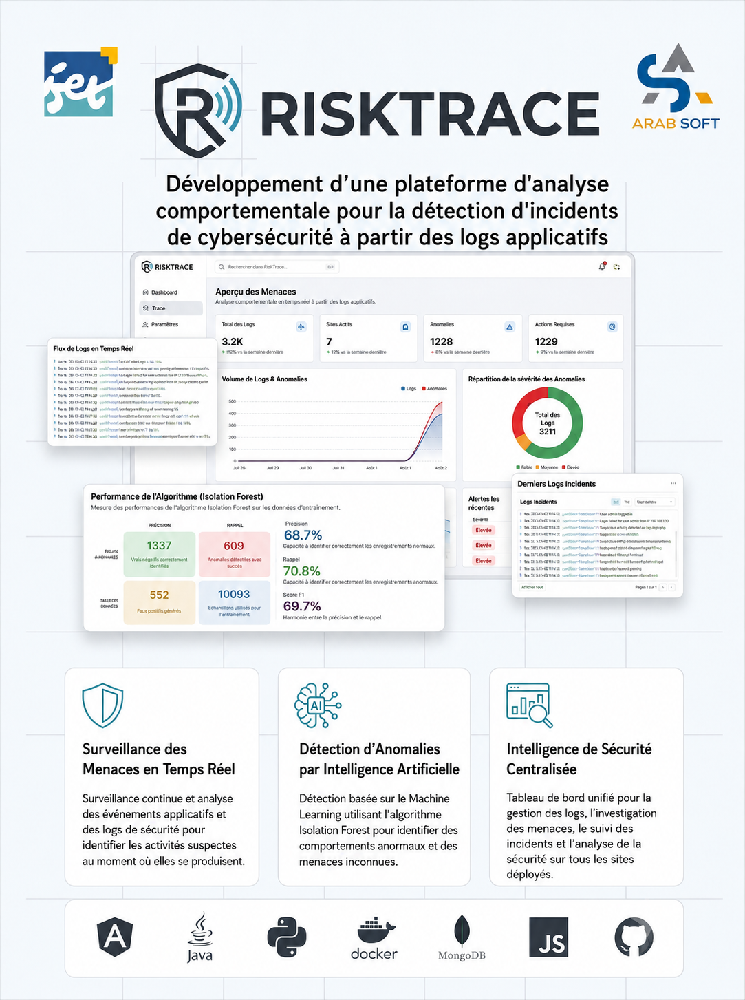

  

# RiskTrace — Intelligent Microservices Monitoring Platform

> *RiskTrace: An intelligent, microservices-based monitoring platform integrating Angular, Spring Boot, and machine learning. Utilizes advanced data engineering (K-Means distillation) and Isolation Forest to detect anomalies in real-time, with automated incident tracking.*

RiskTrace is a robust, highly scalable SaaS security monitoring platform. It is designed to collect massive volumes of web traffic logs across distributed client applications and autonomously detect behavioral anomalies in real-time. Traditional security platforms rely heavily on rigid, signature-based Web Application Firewall (WAF) rules that are blind to zero-day exploits. In contrast, RiskTrace employs an unsupervised **Isolation Forest** model, trained on distilled behavioral data, to identify complex attack patterns without prior knowledge, achieving sub-100ms inference times.

## Platform Overview

The platform is designed to serve a complete cybersecurity ecosystem, categorizing interactions into three distinct domains:

1. **The Organization Analyst / Security Engineer**
   Security teams register their domains and integrate our tracking script. They use the RiskTrace dashboard to monitor incoming traffic, explore detailed logs via a Live Tail feature, and manage the lifecycle of security incidents flagged by the AI engine.
2. **The Platform Administrator**
   The super-users of the RiskTrace ecosystem. They possess overarching control to manage global organizations, oversee user accounts, perform system-wide diagnostics, and monitor the operational health of the microservices.
3. **The Client Web Application**
   The end-point integrations. By embedding a lightweight, asynchronous JavaScript snippet (`tracker.js`), client sites automatically stream telemetry—such as HTTP response times, status codes, JavaScript errors, and path traversal attempts—directly to the RiskTrace Gateway.

### Core Capabilities and Features

* **Authentication & Access Control**
  A zero-trust model utilizing Role-Based Access Control (RBAC). Security features include JWT access tokens, HttpOnly refresh cookies for session rotation, Time-based One-Time Passwords (TOTP) for Two-Factor Authentication (2FA), and secure email verification workflows.
* **Automated Log Collection & Telemetry**
  Data ingestion is entirely non-intrusive. Our custom JavaScript `tracker.js` runs asynchronously in the browser to capture frontend events, while backend integration snippets (available for Node.js, Spring, etc.) capture server-side 500 errors.
* **Real-time Log Exploration**
  A high-throughput log viewer featuring Server-Sent Events (SSE) for Live Tail streaming. Analysts can filter logs dynamically by HTTP status, path, or IP, and export views to CSV or JSON for offline forensic analysis.
* **AI-Powered Anomaly Detection**
  Our unsupervised Machine Learning engine utilizes 12 behavioral dimensions (such as error rates, unique endpoint sweeps, and POST ratios). It utilizes a mathematically optimized threshold (0.70 via F1-Score Argmax) to classify malicious sessions instantly.
* **Alert Management & Incident Escalation**
  When a session exceeds the anomaly threshold, RiskTrace automatically generates an alert, tracking its lifecycle from "OPEN" to "RESOLVED." Critical incidents trigger context-rich Thymeleaf-templated email notifications directly to the organization's owner.
* **Dashboards & Analytics**
  Comprehensive visualizations detailing risk distribution histograms, top offending IP addresses, historical trend analysis, and internal Machine Learning performance metrics (Accuracy, Precision, Recall).

## Video Demonstrations

Below are direct video demonstrations of RiskTrace's core functionalities, showcasing the seamless Angular UI and the real-time processing capabilities of the Spring Boot backend.

### 1. Registration, Organization & Site Setup
The onboarding process includes secure email verification. Users can create their Organization and register their first Domain.
 
<video src="docs/videos/1_auth_and_org_and_site_creation.mp4" controls width="100%"></video>

### 2. Multi-Factor Authentication (2FA)
Demonstrates the integration of TOTP. Users scan the generated QR code with Google Authenticator to secure their RiskTrace accounts.
 
<video src="docs/videos/2_auth_using_2_fa.mp4" controls width="100%"></video>

### 3. API Key & Tracker Integration
Shows how an analyst generates a secure API key and embeds the `tracker.js` snippet into their client website to initiate telemetry ingestion.
 
<video src="docs/videos/3_api_key_implementation_using_a_test_site.mp4" controls width="100%"></video>

### 4. Live Tail Dashboard & ML Analytics
The core analyst view. Incoming logs are streamed in real-time via SSE. The ML Analytics tab provides full visibility into the AI's internal metrics and the anomaly score distributions.
 
<video src="docs/videos/4_dash_board_and_ml_analytics_with_live_tail.mp4" controls width="100%"></video>

### 5. Incident Lifecycle & Alert Escalation
When the Isolation Forest flags a session as anomalous, an alert is generated. Analysts can escalate this incident, instantly triggering a formatted email notification to the site owner.
 
<video src="docs/videos/5_incident_and_alert_escalation.mp4" controls width="100%"></video>

### 6. Admin Panel: Global Management
Platform administrators have dedicated views to consult user roles, enforce suspensions, and completely delete accounts from the ecosystem.
 
<video src="docs/videos/6_admin_user_panel.mp4" controls width="100%"></video>

## Repository Structure

RiskTrace is organized as a multi-repository ecosystem, separating frontend, backend, and machine learning components to allow for independent scaling and development lifecycles.

| Repository | Description |
|---|---|
| [**RiskTrace-Frontend**](./RiskTrace-Frontend) | An Angular 18 Single Page Application featuring a scalable, feature-based architecture (`core/`, `shared/`, `features/`) and a sleek, modern UI utilizing SCSS and Lucide icons. |
| [**RiskTrace-Backend**](./RiskTrace-Backend) | A suite of 6 independent Spring Boot 3 microservices handling API Gateway routing, Eureka Discovery, Users, Sites, Logs, and Alerts. |
| [**RiskTrace-MachineLearning**](./RiskTrace-MachineLearning) | A Python/FastAPI anomaly detection engine, powered by scikit-learn and optimized via K-Means dataset distillation to eliminate false negatives. |

## Architecture Design

RiskTrace embraces a strict **Database-per-Service Microservices Architecture**. This pattern ensures loose coupling, allowing independent deployment, scaling, and technology choices per service, while strictly enforcing domain boundaries.

  

The logical architecture is separated into three primary tiers:
1. **Presentation Layer**: The Angular SPA, consumed by the analysts and administrators.
2. **Gateway Layer**: The Spring Cloud Gateway. It acts as the sole ingress point to the backend, centrally validating JWT signatures and injecting user identity headers into downstream requests.
3. **Business & Data Layer**: Independent Spring Boot microservices backed by isolated MongoDB databases (e.g., `userdb`, `logdb`). Services communicate via REST APIs and locate each other dynamically via Netflix Eureka.

## Deployment & DevOps

### Containerization Strategy (Docker)
The entire local development and testing stack is orchestrated via `docker-compose.yml`. This spins up 8 containers representing the complete RiskTrace ecosystem, ensuring exact parity between development and production environments.

| Container | Technology | Role |
|---|---|---|
| `discovery-service` | Netflix Eureka | Service registry allowing dynamic port resolution. |
| `gateway-service` | Spring Cloud Gateway | API routing, CORS management, & JWT validation. |
| `user-service` | Spring Boot | Authentication, User profiles, Organizations, and Teams. |
| `site-service` | Spring Boot | Site domains, API Keys generation, and validation. |
| `log-service` | Spring Boot + WebFlux | High-throughput log ingestion & SSE streaming. |
| `alert-service` | Spring Boot | Alert processing, anomaly thresholds, & Email notifications. |
| `ml-service` | FastAPI (Python) | High-performance Isolation Forest inference. |
| `frontend` | Nginx + Angular | Client SPA serving. |

### Cloud Infrastructure
- **Frontend**: Continuously deployed to **Vercel**, leveraging global edge networks for rapid delivery.
- **Backend & ML**: Hosted on **Render**, utilizing isolated Docker environments for the microservices to ensure consistent execution.
- **Database**: We use a managed **MongoDB Atlas** cluster in the cloud, which provides horizontal scalability and eliminates the operational overhead of managing local database instances.

### Environment Management
All configuration secrets—such as JWT signing keys, MongoDB connection strings, and SMTP email credentials—are securely injected via `.env` files. We provide an `.env.example` file in the root directory to outline the required structural template for new developers.

## Testing & Quality Assurance

Quality assurance across the RiskTrace ecosystem relies on a strict 3-layer testing approach:

1. **Backend Integration & Unit Tests**: Utilizing JUnit and Mockito, we extensively mock HTTP requests to test our custom security filters, JWT validations, and RBAC enforcement. We ensure endpoints correctly reject unauthorized access attempts.
2. **Machine Learning Resilience**: The ML engine is tested via `test_tracker_sim.py`, simulating specific attack personas (Brute Forcers, Scanners). We also perform boundary auditing (`test_full_audit.py`) to guarantee the model correctly coerces malformed or noisy data sent from the backend without crashing.
3. **Frontend Guarding**: We perform rigorous Route Guard testing in Angular to verify that unauthenticated users are seamlessly redirected to login pages, and that sessions are cleanly destroyed upon logout or token expiration.
